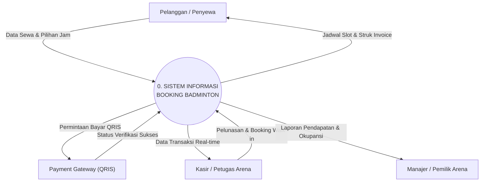

# Context Diagram (Diagram Konteks) - Model Kompas 4 Arah
## UKK RPL / PPLG - Aplikasi Booking Lapangan Badminton

Diagram Konteks ini didesain simetris menggunakan tata letak **Radial Kompas 4 Arah (*Compass Layout*)** persis standar baku rekayasa perangkat lunak:
- **Tengah (Pusat)**: Proses Tunggal Sistem Lingkaran
- **Atas (North)**: Pelanggan / Penyewa Lapangan
- **Kiri (West)**: Layanan Pembayaran Digital (QRIS Gateway)
- **Kanan (East)**: Kasir / Petugas Operasional
- **Bawah (South)**: Manajer / Pemilik Arena

---

## 1. Tautan Langsung Mermaid Live Editor
Buka tautan berikut di peramban untuk melihat visualisasi kompas 4 arah atau mengunduh dalam format SVG / PNG:

**[Buka Context Diagram Model Kompas di Mermaid Live](https://mermaid.live/edit#pako:eNp9VGFP2zAQ_SunTKBWojBgn6oJyaVdCW2TLgnwYZmma-O2XhKncpyVDvjvsx0vhAG7L3Hte--e31394CyLhDp9cFZZsVtuUEiIhjEHFQcHcHoMcz90QxdIRELoeH4QXXXr4_loSrzxmHjfYmdOM-TrNXI4gTnle7rD2Pke84borCGKRt6YXEFnQAISQQ_mN6H5Ru7sJrDUZbVYC9xuQCW54Y8aosqAIQUbCRN0KVnBYRo8735VCK0I9znlEsYolZg9dPR-9wVeyYlGs04ndj4e2x_gel_8YEZC9_NCnFwMfH_iemMlYzhzvcj3YqfbfSaYqLxA1ZpgyYS5uazWWAIRlGNTivKkZcR5Y8SA3GkfQv-msXRGPHI90pQz5PiT1qQ5y1jaIm24rlzdgQnxYOJHZAKXvhcR1xsFtW_Wamup3Gf0hZ-wYlnW5wWnR6UURUrNukVPpm6guIeq9bb9Tcv_HQHo9S4eY2eIEiFUfsMhzJXqjRqIa8xj59H6W8Os1zXmGpMdZhBmhVSoUIoqBZf_KtiSalxT4h1h9RjZ7r5mn1ORMy5RCRngHoUZD81rvvzvwNjsUKKsSrilgq1YqroKYZWWtGxf4E0VZnihYwbCyjDrRkVWcSyViEMYFEXK-BruMEt7jP_XG-NnJJCXmCoxAcWsJ1lujDH875piRsuO01u-THFbKF79Z01wq8poaX5abVUtpuktNubOETi5chFZop-JB00WO3JDtYy-Wi6wVKuj1v4tCoaLTPvWh4e6euxsBctR7C-LrBA18sPKhAW3ciJ6L9t5pyZe5w0KkVDRzjwz0crMGKfthHMTrYRVwWXIftvLnH7a3seOPnuK-ZO-O1ayCPd8qY7VbFK1U20T9agMGao3KrfbT38A-YyJqg)**

---

## 2. Kode Diagram Mermaid (Model Kompas Simetris)

---

## 3. Rincian Aliran Data 4 Penjuru

1. **Atas (Pelanggan)**:
   - Panah Turun (Input): Mengirim formulir data booking, nama, tanggal, dan slot jam yang dipilih.
   - Panah Naik (Output): Menerima info slot ketersediaan lapangan dan struk digital invoice.
2. **Kiri (Payment Gateway / QRIS)**:
   - Panah Kiri (Output Sistem): Mengirim nominal tagihan untuk dibuatkan QRIS dinamis.
   - Panah Kanan (Input Sistem): Mengembalikan status verifikasi pembayaran sukses ke sistem.
3. **Kanan (Kasir / Petugas)**:
   - Panah Masuk (Input): Mengirim data pelunasan sisa tagihan DP dan booking langsung (walk-in).
   - Panah Keluar (Output): Menerima daftar antrean pesanan real-time dan cetak bukti transaksi.
4. **Bawah (Manajer / Pemilik)**:
   - Panah Turun (Output Sistem): Menerima laporan omzet pendapatan harian/bulanan serta tingkat okupansi lapangan.
