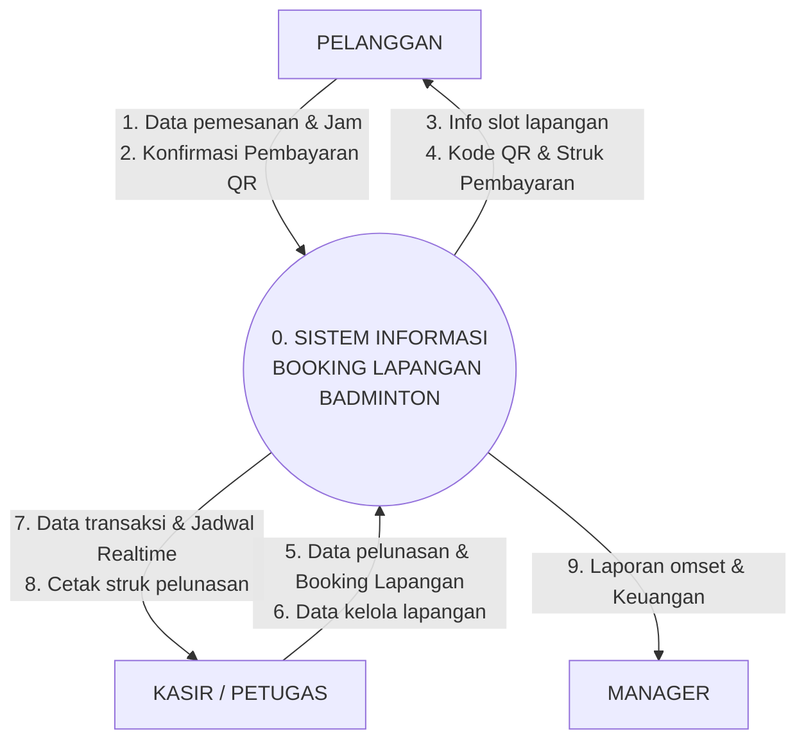

# Context Diagram (Diagram Konteks) Resmi UKK
## Aplikasi Booking Lapangan Badminton

Diagram Konteks ini telah diselaraskan persis dengan tata letak visual final:
- **Atas**: `PELANGGAN`
- **Tengah**: `0. SISTEM INFORMASI BOOKING LAPANGAN BADMINTON`
- **Bawah**: `KASIR / PETUGAS`
- **Kanan**: `MANAGER`

---

## 1. Tautan Langsung Mermaid Live Editor
Buka tautan berikut di peramban untuk melihat visualisasi diagram atau mengunduh dalam format SVG / PNG:

**[Buka Context Diagram Final di Mermaid Live](https://mermaid.live/edit#pako:eNp9km1vmzAQx7_KyVKnRFrpnp80VXKWDFECyUL2at6LS3AIwtgRNoqqtt99Z0JpNHXjDbbv7nf__9l3bGtyyb4A2ylz3O6xcbCeCg30LWdznoYhT38JNqwF-32KZlG2niWjkWCvgn4DUfp9sUp4Fn3dNFfXk8UijtIQ5nxJtTyFCZ8mUbpeEGQ8PlFiSl4Rv_vDFfVc_wx5NnRJeMrDmc_oV13kFLu4AK7KBjVM0SEspUJdFLQdcYd2_JcJuLy8vhfsdXDKPshaWtSU_QJusO4EvwkgNnpXNjXaknj1Bm_R839Q2_ve5Ln7nvk2gEjvDFhlHCg8kAzUHfGdJ-aSANQmc01bnWE982muz5uKSUkDowkecX8-sr7z-8GNajXazs3EmKrUBczPhXzoEyupjMJB5H9tfexrHKmxWNFI_KjyIypYSVSurGXH_hTAN-mwAtsZHLR4eCf2H94SGn8hyV3s72H8jILPgXdhfIWprXQkIJbtoPzxSWj2Elgt6drK3D_lO48SzO3pjgUdCLZBSyuhH3wmts5kt3pLERIs6aQ95OjktMSiwbo_fvgDp4TxSQ)**

---

## 2. Kode Diagram Mermaid (Persis Gambar Pengguna)

---

## 3. Rincian 9 Aliran Data Baku

### A. Pelanggan (Pengguna Web)
1. **1. Data pemesanan & Jam**: Input formulir nama, telepon, tanggal, dan slot jam yang dipilih.
2. **2. Konfirmasi Pembayaran QR**: Bukti pembayaran DP 50% atau Lunas via QRIS online.
3. **3. Info slot lapangan**: Output jadwal ketersediaan lapangan (kosong vs terisi).
4. **4. Kode QR & Struk Pembayaran**: Output invoice pemesanan digital dan timer pembayaran.

### B. Kasir / Petugas (Operasional Arena)
5. **5. Data pelunasan & Booking Lapangan**: Input pelunasan sisa bayar (Tunai/QRIS) dan input booking walk-in.
6. **6. Data kelola lapangan**: Input penambahan lapangan baru, ubah harga sewa, dan status lapangan.
7. **7. Data transaksi & Jadwal Realtime**: Output antrean pemesan dan visualisasi okupansi lapangan harian.
8. **8. Cetak struk pelunasan**: Output cetak nota bukti pelunasan fisik (`window.print()`).

### C. Manager (Pimpinan / Pemilik)
9. **9. Laporan omset & Keuangan**: Output rekapitulasi pendapatan harian/bulanan serta tingkat okupansi lapangan dari tab Overview kasir.

---

## 4. Tips Jawaban Sidang jika Penguji Menanyakan "Manager"
Jika penguji bertanya: *"Mana menu khusus untuk Manager di aplikasi kamu?"*
> **Jawaban Aman & Tepat**: *"Laporan untuk Manager diambil dari tab **Overview Analitik** di panel kasir pak/bu. Di sana ada ringkasan total omset uang masuk, tingkat keterisian lapangan harian, dan grafik jam paling diminati yang bisa langsung dicetak atau diserahkan ke Manager."*
