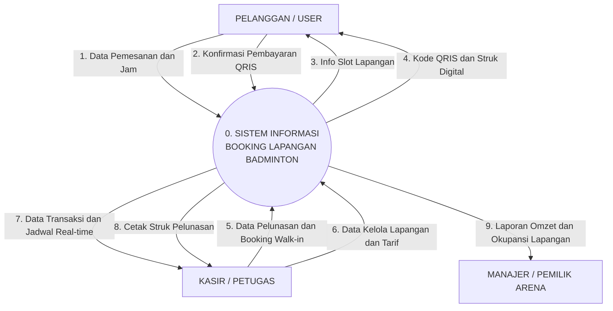

# Context Diagram (Diagram Konteks) - UKK RPL / PPLG
## Aplikasi Booking Lapangan Badminton

Dokumen ini memenuhi **Kriteria Penilaian No. 5 Pra-UKK**:
> *"Context Diagram dibuat"*

Diagram Konteks menggambarkan sistem secara global (*lingkup makro / black box*) sebagai satu proses tunggal untuk melihat aliran data masuk dan keluar antara sistem dengan entitas luar (aktor).

---

## 1. Tautan Langsung Mermaid Live Editor (Bebas Error)
Buka tautan berikut di peramban untuk melihat visualisasi diagram atau mengunduh dalam format SVG / PNG:

**[Buka Context Diagram Bebas Error di Mermaid Live](https://mermaid.live/edit#pako:eNp9km9vmzAQxr_Kya9aqaFb96-rpkrOYBElQIap9iLsxTU4qYWxK2JUdW2_e23isSiKhgRYvnue-93Zz2Sla06ugKylflzdY2egDCsF9llEc5rNZjRbjis4h1sWFb93CQllcbEcvjawiMrbGWU-ltKM3kTF0v-HeBrP4wRoEWXUZu3yWMzKKD05eRf4JcTZj7xIrem3u-78eprnSZzNYE4XFsESTGmYxlmZZ6enfz3-4U0m1y8VeR9AiAZhwVu-RYUKavveYFuRF1_luPAigESrteha3Aonv8Mn7Kz2ZxGzQ7HH3Sk_BBCrtQYmtYE5PqDaoHKKscQR0UdXruaD-4DITNc3EIqNMCgP1Hsj9_JPY5uyV7j1bU61boTawC-UzUSoQ-p9g8_eIOFSSxyxB5sSO7H-b8tfvLq0A9piYwe2m3L9iBIKjnJiRMudxVDziMNlAN-5wcb3Pfaxpzmi-ho4Uu2OJW__cDOUzZvewluG_dn7u1cpcgak5fZURe2u-rNzrYi5547vyi5r7JqKVOrVZWJvNHtSKxuxXNzu9A81Gh4K3HTY-u3XN61e99Y)**

---

## 2. Kode Diagram Mermaid Bersih (Bebas Parse Error)

---

## 3. Rincian Aliran Data Masuk & Keluar

### A. Entitas `PELANGGAN`
- **Data Masuk (Input)**:
  1. Data Pemesanan (Nama, No WhatsApp, Email, Tanggal, Lapangan, dan Pilihan Slot Jam).
  2. Konfirmasi Pembayaran QRIS (Verifikasi nominal DP 50% atau Lunas).
- **Data Keluar (Output)**:
  1. Info Ketersediaan Slot (Matriks visual jadwal kosong vs terisi).
  2. Kode QRIS dan Struk Digital / Invoice Booking resmi.

### B. Entitas `KASIR / PETUGAS`
- **Data Masuk (Input)**:
  1. Data Pelunasan Sisa DP (Verifikasi pelunasan tunai atau QRIS di meja kasir).
  2. Data Booking Walk-in (Pemesanan langsung di tempat tanpa lewat website).
  3. Data Kelola Lapangan (Penambahan lapangan, pembaruan tarif per jam, ubah status).
- **Data Keluar (Output)**:
  1. Data Transaksi Real-time (Daftar antrean pemesan untuk check-in).
  2. Struk Cetak Pelunasan Fisik (`window.print()`).

### C. Entitas `MANAJER / PEMILIK ARENA`
- **Data Keluar (Output)**:
  1. Laporan Pendapatan (Total uang masuk harian/bulanan dari DP dan pelunasan).
  2. Laporan Okupansi Lapangan (Tingkat keterisian lapangan dan jam-jam paling diminati).

---

## 4. Bocoran Pertanyaan Penguji UKK & Cara Jawabnya

### 1. "Kenapa di Diagram Konteks TIDAK ADA simbol Database (Data Store)?"
> **Jawaban Emas**: *"Karena Diagram Konteks adalah level tertinggi (Level 0 Global) yang memandang sistem sebagai satu kotak hitam (black box). Aturan baku rekayasa perangkat lunak menyatakan bahwa media penyimpanan basis data baru boleh digambarkan pada rincian Data Flow Diagram (DFD) Level 1 pak/bu."*

### 2. "Apa arti lingkaran angka 0 di tengah?"
> **Jawaban Emas**: *"Lingkaran 0 melambangkan Proses Utama sistem yang mencakup seluruh fungsi aplikasi secara terintegrasi."*

### 3. "Siapa saja entitas luar (terminator) di sistem kamu?"
> **Jawaban Emas**: *"Ada 3 entitas luar: Pelanggan (pemesan online), Kasir/Petugas (operasional sewa & pelunasan), dan Manajer/Pemilik (penerima laporan pendapatan)."*
