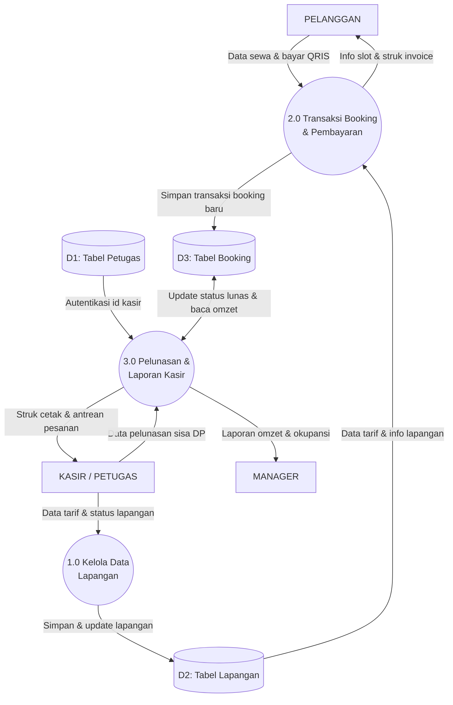

# Data Flow Diagram (DFD) Level 1 - UKK RPL / PPLG
## Aplikasi Booking Lapangan Badminton

Dokumen ini memenuhi **Kriteria Penilaian No. 6 Pra-UKK**:
> *"Data Flow Diagram dibuat"*

DFD Level 1 adalah dekomposisi (rincian bagian dalam) dari Diagram Konteks (Level 0). Lingkaran utama dipecah menjadi **3 Proses Inti** dan memunculkan **3 Data Store (Tabel Database)** untuk melihat ke mana data disimpan dan dari mana data dibaca.

---

## 1. Tautan Langsung Mermaid Live Editor
Buka tautan berikut di peramban untuk melihat visualisasi DFD Level 1 atau mengunduh dalam format SVG / PNG:

**[Buka DFD Level 1 di Mermaid Live Editor](https://mermaid.live/edit#pako:eNp1VNtum0AQ_ZURUiwsNU4Nb1YUaSOQhaCYsvgp9GFsbxzEzYKlUZrk3zu7XGpHNS-Mds7Mnjlz4N3Y1wdhrMB4LurX_Qs2EhInrYCemxtYLsANEy9hHIIti8FkfrKJ530-cgMWrtcsfEqNKU6NX33WZ9yLKaPfcEfoZLtmfMr_YCFbuwoxRDoz3WwtIPDCtc9iFkIUb7jLh1uXppkay8V38EVRFwgOSrzfNXcPAZ6wOmKVGvORoaWwFmGTBqsW8zaDx7rOs-qoK2YQiXKHb9hcVNmqyqaqSBRdhS1WMBtvqAkKPrZZ0xdMhO0FOCxhwEkgF0wVPzLuAt9GOhiaO8snau4sV5DgThR0heyO2FKzQRfH0gBrBJxNNSJsjbBHxDBRD5j4sMD7Jx0ovUzfDTYBg4BFtCsWzs8WBbe3Dx_UlLQEiU32DDNoJcquhWIi8EHij0sYCnhWnpQ80J0OKMUF2LGu0lErMRM64MznHjxuNj4t-6uvzkm14hXpGr0s-Bl7XNOxRs3-xz-rnutL9tZoiwHuKURb1FJP23Q51fyus73Q6MnSl0XDyHJy1K7Xn7g1nZ7bvjq3MpVJjbch43Q6U7vYxNdXcZoM2GYtWT3SxOzRSgOUdVJUMsvJlZAdIO_deQa04b5HbvstjZtVvbWoe4S6_CPkeVVkV6K1MnsRMScwVrIRROgkiFavq6b9pWj8VHRbKqvzjtRoM4UfP_jG-AZGIZoSs4P6Bb2rHqkhX0RJG1hRuMOWorT6VEjsZM3fqj1liJGgk950ToZHh8vh-e0vo_hnXA)**

---

## 2. Kode Diagram Mermaid DFD Level 1 (Tanpa Kotak Pembungkus)

---

## 3. Rincian 3 Proses Utama & 3 Data Store

### A. Proses 1.0: Kelola Data Lapangan
- **Aktor**: Kasir / Petugas Admin.
- **Fungsi**: Menerima input nama lapangan, tarif sewa per jam, dan status operasional (Aktif / Tutup Perawatan).
- **Data Store**: Menyimpan dan memperbarui data ke **D2: Tabel Lapangan**.

### B. Proses 2.0: Transaksi Booking & Pembayaran
- **Aktor**: Pelanggan (Online) & Kasir (Walk-in).
- **Fungsi**: Membaca tarif lapangan dari **D2**, menghitung total sewa dan DP 50%, memvalidasi anti-bentrok, memproses QRIS, menerbitkan struk digital invoice ke Pelanggan.
- **Data Store**: Menyimpan data pesanan baru berstatus `DP` atau `Lunas` ke **D3: Tabel Booking**.

### C. Proses 3.0: Pelunasan & Laporan Kasir
- **Aktor**: Kasir / Petugas dan Manager.
- **Fungsi**: Kasir menginput pelunasan sisa bayar (Tunai/QRIS), sistem memverifikasi akun kasir dari **D1**, mengupdate status pesanan di **D3** menjadi `Lunas` (sisa bayar Rp 0), mencetak struk fisik, serta merekap omzet pendapatan untuk dikirim ke **Manager**.

---

## 4. Bocoran Pertanyaan Penguji UKK & Cara Jawabnya

### 1. "Apa bedanya Context Diagram dengan DFD Level 1?"
> **Jawaban Emas**: *"Context Diagram hanya memperlihatkan sistem secara global dari luar (sebagai 1 lingkaran 0 tanpa database). Sedangkan DFD Level 1 membedah proses di dalam sistem menjadi 3 proses inti (1.0, 2.0, 3.0) serta memperlihatkan tabel-tabel database penyimpanannya (D1, D2, D3) pak/bu."*

### 2. "Apa arti simbol dua garis / tabung silinder D1, D2, D3?"
> **Jawaban Emas**: *"Itu adalah simbol **Data Store**, yaitu tempat penyimpanan data permanen di basis data PostgreSQL Supabase kami."*

### 3. "Kenapa panah D3 ke Proses 3.0 bolak-balik (`<-->`)?"
> **Jawaban Emas**: *"Karena Proses 3.0 melakukan dua hal: **Membaca** data transaksi lama untuk dilunasi/dihitung omzetnya, lalu **Menulis kembali (Update)** statusnya menjadi Lunas ke tabel yang sama."*
