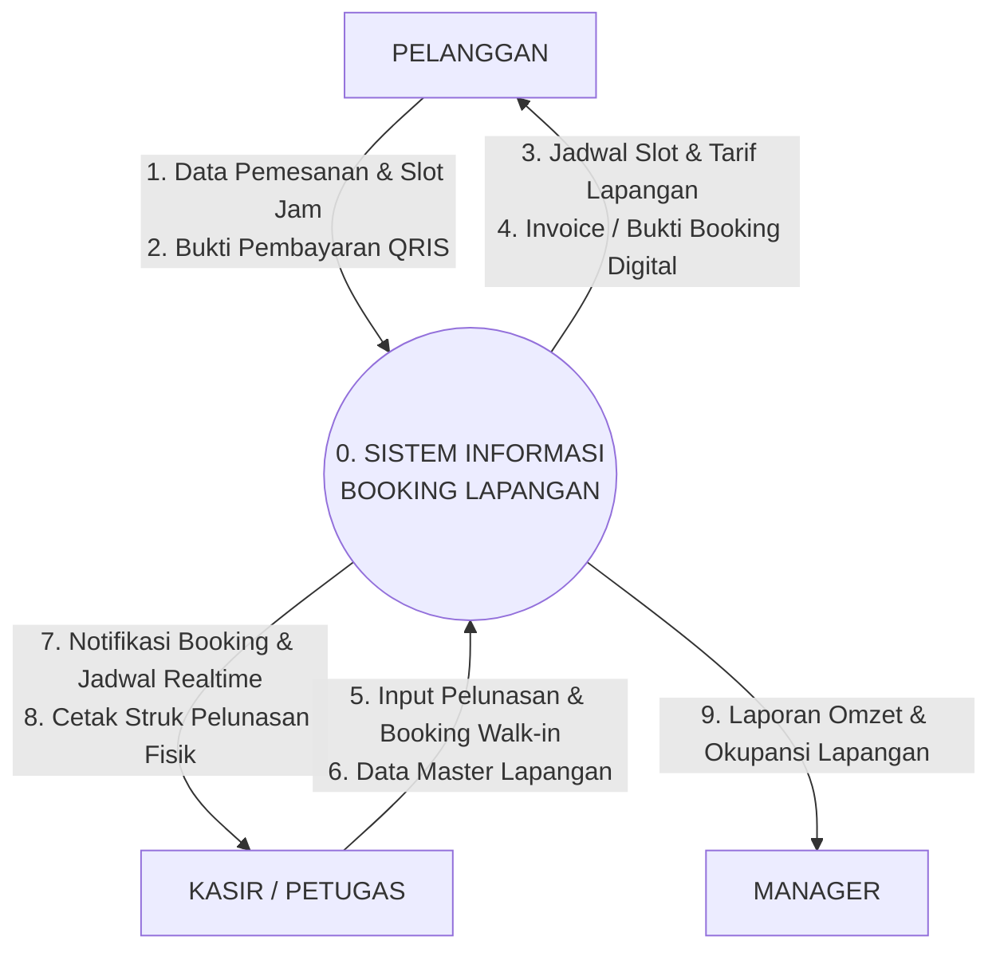
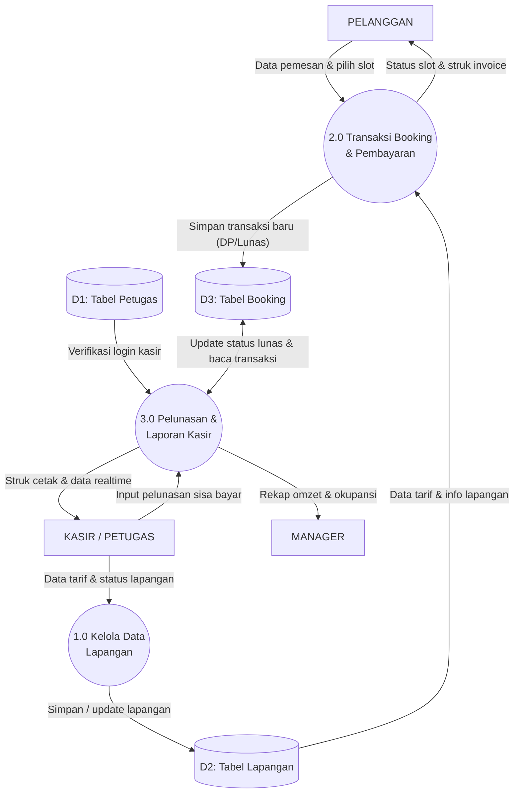
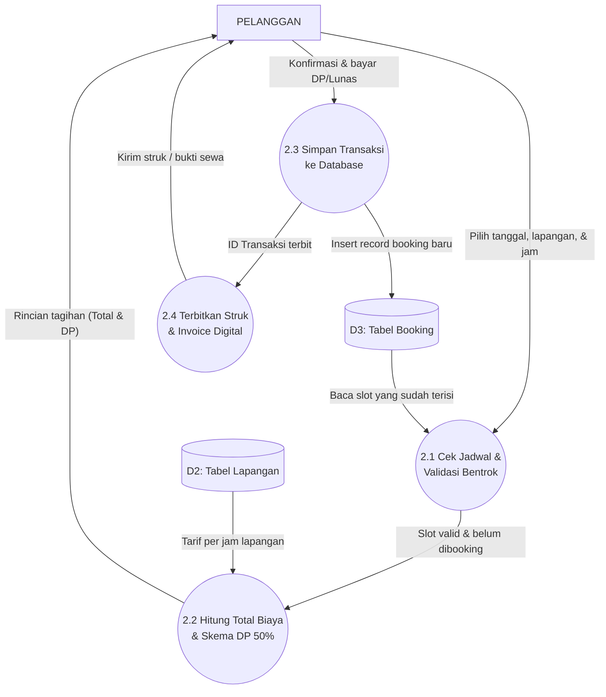
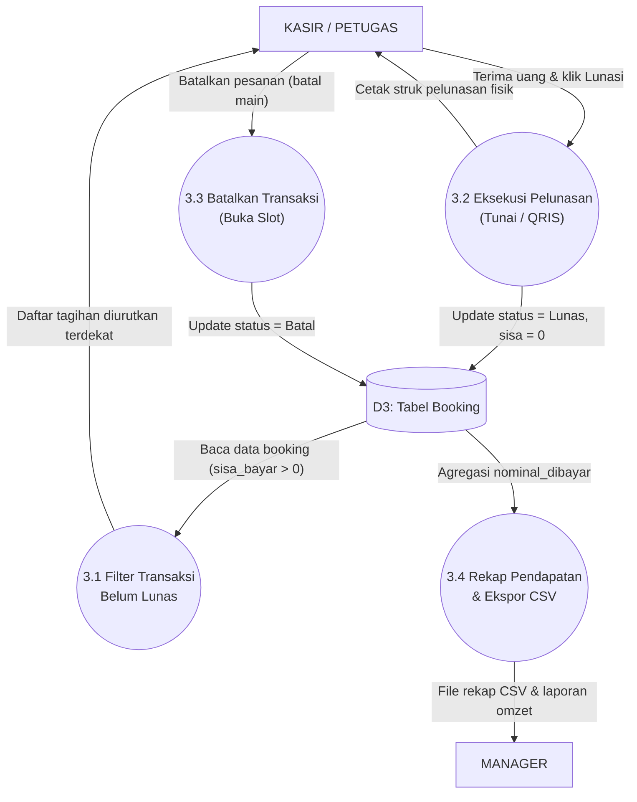

# Data Flow Diagram (DFD) Lengkap - UKK RPL / PPLG
## Aplikasi Booking Lapangan Badminton (Blanca Badminton Arena)

Dokumen ini adalah standar resmi penyusunan **Data Flow Diagram (DFD)** untuk laporan UKK dan materi presentasi penguji, mencakup **Level 0 (Diagram Konteks)**, **Level 1**, **Level 2**, dan **Kamus Data (Data Dictionary)**.

---

## 1. DFD Level 0 (Diagram Konteks)

Diagram Konteks menggambarkan batasan sistem secara menyeluruh dari sudut pandang entitas luar (*External Entities*).

```mermaid
flowchart TD
    PELANGGAN["PELANGGAN"]
    SISTEM(("0. SISTEM INFORMASI<br/>BOOKING LAPANGAN"))
    KASIR["KASIR / PETUGAS"]
    MANAGER["MANAGER"]

    %% Aliran Data Pelanggan
    PELANGGAN -->|"1. Data Pemesanan & Slot Jam<br/>2. Bukti Pembayaran QRIS"| SISTEM
    SISTEM -->|"3. Jadwal Slot & Tarif Lapangan<br/>4. Invoice / Bukti Booking Digital"| PELANGGAN

    %% Aliran Data Kasir
    KASIR -->|"5. Input Pelunasan & Booking Walk-in<br/>6. Data Master Lapangan"| SISTEM
    SISTEM -->|"7. Notifikasi Booking & Jadwal Realtime<br/>8. Cetak Struk Pelunasan Fisik"| KASIR

    %% Aliran Data Manager
    SISTEM -->|"9. Laporan Omzet & Okupansi Lapangan"| MANAGER
```

---

## 2. DFD Level 1 (Dekomposisi Proses Inti)

DFD Level 1 memecah sistem 0 menjadi **3 Proses Utama** dan menghubungkannya ke **3 Data Store (Tabel Supabase)**.

```mermaid
flowchart TD
    PELANGGAN["PELANGGAN"]
    KASIR["KASIR / PETUGAS"]
    MANAGER["MANAGER"]

    P1(("1.0 Kelola Data<br/>Lapangan"))
    P2(("2.0 Transaksi Booking<br/>& Pembayaran"))
    P3(("3.0 Pelunasan &<br/>Laporan Kasir"))

    D1[("D1: Tabel Petugas")]
    D2[("D2: Tabel Lapangan")]
    D3[("D3: Tabel Booking")]

    %% Proses 1.0 (Kelola Lapangan)
    KASIR -->|"Data tarif & status lapangan"| P1
    P1 -->|"Simpan / update lapangan"| D2

    %% Proses 2.0 (Transaksi Booking)
    PELANGGAN -->|"Data pemesan & pilih slot"| P2
    D2 -->|"Data tarif & info lapangan"| P2
    P2 -->|"Status slot & struk invoice"| PELANGGAN
    P2 -->|"Simpan transaksi baru (DP/Lunas)"| D3

    %% Proses 3.0 (Pelunasan & Laporan)
    KASIR -->|"Input pelunasan sisa bayar"| P3
    D1 -->|"Verifikasi login kasir"| P3
    D3 <-->|"Update status lunas & baca transaksi"| P3
    P3 -->|"Struk cetak & data realtime"| KASIR
    P3 -->|"Rekap omzet & okupansi"| MANAGER
```

---

## 3. DFD Level 2: Proses 2.0 (Transaksi Booking)

Dekomposisi rinci untuk proses pemesanan lapangan dan validasi anti-bentrok jadwal:

```mermaid
flowchart TD
    PELANGGAN["PELANGGAN"]
    D2[("D2: Tabel Lapangan")]
    D3[("D3: Tabel Booking")]

    P21(("2.1 Cek Jadwal &<br/>Validasi Bentrok"))
    P22(("2.2 Hitung Total Biaya<br/>& Skema DP 50%"))
    P23(("2.3 Simpan Transaksi<br/>ke Database"))
    P24(("2.4 Terbitkan Struk<br/>& Invoice Digital"))

    PELANGGAN -->|"Pilih tanggal, lapangan, & jam"| P21
    D3 -->|"Baca slot yang sudah terisi"| P21
    P21 -->|"Slot valid & belum dibooking"| P22
    D2 -->|"Tarif per jam lapangan"| P22

    P22 -->|"Rincian tagihan (Total & DP)"| PELANGGAN
    PELANGGAN -->|"Konfirmasi & bayar DP/Lunas"| P23
    P23 -->|"Insert record booking baru"| D3
    P23 -->|"ID Transaksi terbit"| P24
    P24 -->|"Kirim struk / bukti sewa"| PELANGGAN
```

---

## 4. DFD Level 2: Proses 3.0 (Pelunasan & Laporan Kasir)

Dekomposisi rinci untuk proses pelunasan di meja kasir dan pelaporan:

```mermaid
flowchart TD
    KASIR["KASIR / PETUGAS"]
    MANAGER["MANAGER"]
    D3[("D3: Tabel Booking")]

    P31(("3.1 Filter Transaksi<br/>Belum Lunas"))
    P32(("3.2 Eksekusi Pelunasan<br/>(Tunai / QRIS)"))
    P33(("3.3 Batalkan Transaksi<br/>(Buka Slot)"))
    P34(("3.4 Rekap Pendapatan<br/>& Ekspor CSV"))

    D3 -->|"Baca data booking (sisa_bayar > 0)"| P31
    P31 -->|"Daftar tagihan diurutkan terdekat"| KASIR

    KASIR -->|"Terima uang & klik Lunasi"| P32
    P32 -->|"Update status = Lunas, sisa = 0"| D3
    P32 -->|"Cetak struk pelunasan fisik"| KASIR

    KASIR -->|"Batalkan pesanan (batal main)"| P33
    P33 -->|"Update status = Batal"| D3

    D3 -->|"Agregasi nominal_dibayar"| P34
    P34 -->|"File rekap CSV & laporan omzet"| MANAGER
```

---

## 5. Kamus Data (Data Dictionary) Resmi

### A. Arus Data (Data Flows)

| Nama Arus Data | Sumber | Tujuan | Struktur / Elemen Data |
| :--- | :--- | :--- | :--- |
| `Data_Pemesanan` | Pelanggan | 2.1 | `nama_penyewa` + `no_hp` + `lapangan_id` + `tgl_main` + `jam_slots` |
| `Tarif_Lapangan` | D2 Lapangan | 2.2 | `id` + `nama_lapangan` + `tarif_per_jam` + `status` |
| `Simpan_Booking` | 2.3 | D3 Booking | `id` + `nama_penyewa` + `tgl_main` + `jam_slots` + `total_bayar` + `nominal_dibayar` + `sisa_bayar` + `tipe_bayar` + `status` |
| `Pelunasan_Sisa` | Kasir | 3.2 | `id_booking` + `sisa_bayar (= 0)` + `status (= 'Lunas')` |
| `Laporan_Omzet` | 3.4 | Manager | `periode` + `total_pendapatan` + `total_booking` + `tingkat_okupansi` |

### B. Data Store (Simpanan Data)

- **D1: Tabel Petugas** = `id` + `username` + `password` + `nama_petugas` + `role`
- **D2: Tabel Lapangan** = `id` + `nama_lapangan` + `tarif_per_jam` + `status`
- **D3: Tabel Booking** = `id` + `lapangan_id` + `nama_penyewa` + `no_hp` + `tgl_main` + `jam_slots` + `durasi_jam` + `total_bayar` + `nominal_dibayar` + `sisa_bayar` + `tipe_bayar` + `status` + `created_at`

---

## 6. Cara Ekspor Diagram ke Figma & Laporan Word

1. Buka [Mermaid Live Editor](https://mermaid.live).
2. Salin kode diagram dari bab di atas dan tempelkan ke editor.
3. Klik tombol **Actions > Download SVG** (format vektor tajam tanpa pecah).
4. Di Figma: seret (*drag-and-drop*) file SVG langsung ke dalam kanvas Figma. Diagram akan otomatis terpecah menjadi objek vektor rapi yang bisa diwarnai atau diatur fontnya.
5. Di Microsoft Word: klik **Insert > Pictures** lalu pilih file SVG/PNG yang sudah diunduh.

---

## 7. Bocoran Pertanyaan Penguji UKK Terkait DFD

1. **"Mengapa tabel Petugas tidak terhubung ke proses 2.0?"**
   - *Jawaban*: *"Karena proses 2.0 adalah pemesanan mandiri oleh pelanggan publik via web, sehingga tidak memerlukan login petugas. Tabel Petugas hanya diakses saat proses 1.0 (kelola lapangan) dan 3.0 (pelunasan kasir) untuk otorisasi hak akses."*

2. **"Apa itu entitas luar (External Entity) di DFD?"**
   - *Jawaban*: *"Entitas luar adalah pihak atau aktor di luar batas sistem yang memberikan input data atau menerima output data dari sistem, yaitu Pelanggan, Kasir/Petugas, dan Manager."*

3. **"Apa bedanya DFD Level 1 dan Level 2?"**
   - *Jawaban*: *"DFD Level 1 memecah sistem global menjadi proses-proses inti tingkat pertama (1.0, 2.0, 3.0). DFD Level 2 membedah sub-proses yang ada di dalam proses tersebut menjadi lebih terperinci (misal: 2.1 cek bentrok, 2.2 hitung DP, 2.3 simpan ke database)."*
