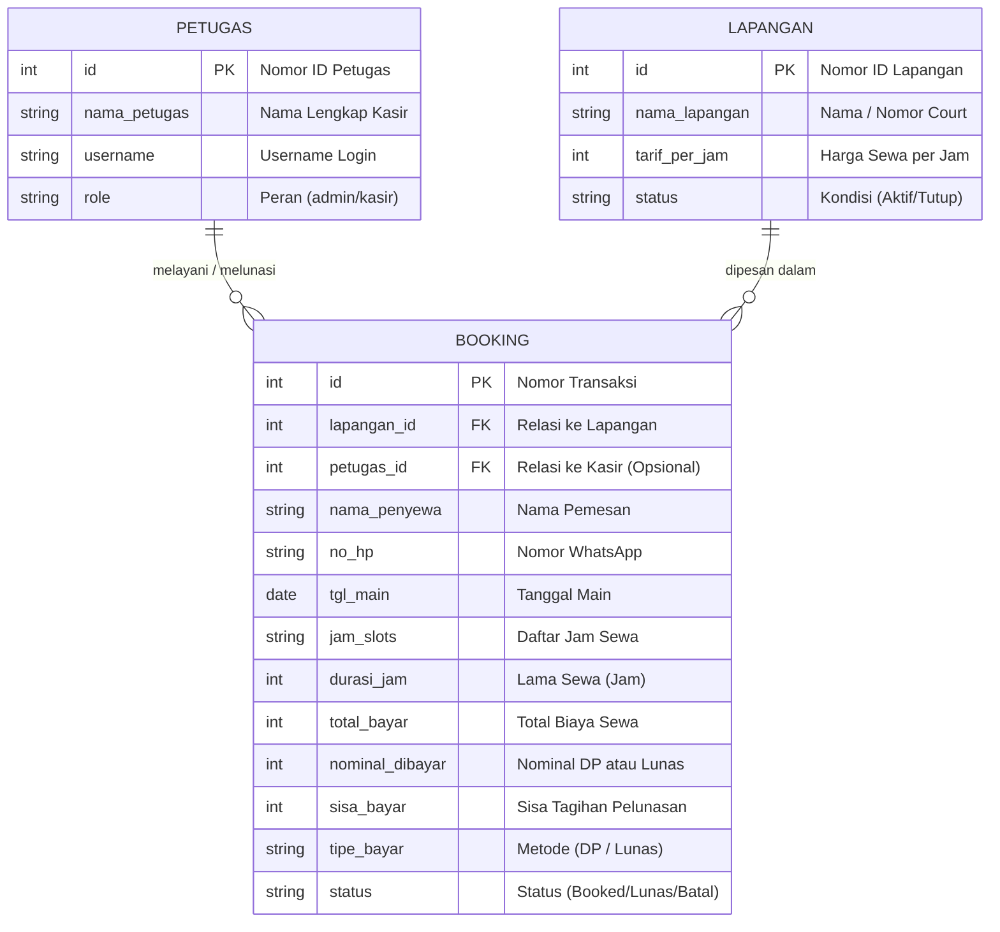

# Entity Relationship Diagram (ERD) - UKK RPL / PPLG
## Aplikasi Booking Lapangan Badminton

Dokumen ini memenuhi **Kriteria Penilaian No. 4 Pra-UKK**:
> *"Entity Relationship Diagram dibuat"*

Diagram ini menggambarkan susunan 3 tabel utama di database Supabase (PostgreSQL) serta bagaimana tabel-tabel tersebut saling terhubung secara otomatis.

---

## 1. Tautan Langsung Mermaid Live Editor
Klik tautan berikut untuk membuka diagram ERD langsung di peramban (bisa diunduh format SVG/PNG):

**[Buka ERD di Mermaid Live Editor](https://mermaid.live/edit#pako:eNqFVMtu2zAQ_JWFTjLQQPfc5Lp1UyuyUDvoxYCwjWiZlUQKfKAwHP97d_VwXEdJeeJjhruzs-QpeNaFCO4hEGYhsTTY7BTQyL5sn5bxBl5e7u70Cebr9eohXcI97IJG1HhEJSECmnqFVu6CnpXEWZwu43SKVshWWFRQYE1BiPBvoFO_5CGVA1lAtiJWqhtt4GEBmXC-RDtG4mGdkaoEhQ3mbX_MDFpCIlRZYQsrSs5McLwVhniC8E_jNNGlVBNYo2vGZcJQ9iEWjVRRxffORvB5FHPR_z81CbaoSlTvyamH81FPBD31s_bGXZP4dodG7qkCJv-NDTG-oSkRNuIPAm3C977cN2GsQ-e5XiutCmklhHHl5D7aeufbt8pGJz8UtqUKWaxe-2GEjXJywn9l_A_qIYpZiclKMGUwdILReQrhurVSK6xn77eEOnINhhJmouH-m0Lr_NBeRPw8oLNx214DC3QCXFnnDUr2ZEspl1jDI052DNmQ21o7Lu8C9-QPm9A5ciuz8IbkDMYlnGfnW0j42RuftcM6_0WPz3AOvIK5pOXkzUpToxK-kCMj7XdgkQE69JDw272lWWnxEmNDC9hiKQ_Uiln_2CdL6OhxX1iPwtGnAiHFifogs48acNNPwrnWlSiijhDNKcP6ug2DT0A_jyEDCv6uuj7cBe5Aru6C7n9BUzH-zEj0Tm-O6plOnPGCdnzLJg5_3LB9_gvtK49i)**

---

## 2. Kode Diagram Mermaid (Salin ke FigJam / Mermaid Live)

---

## 3. Penjelasan Hubungan Relasi (Bahasa Santai & Mudah Dipahami)

### A. Hubungan `LAPANGAN` ke `BOOKING` (1-ke-Banyak)
- **Artinya**: 1 Lapangan bisa dipakai berulang kali untuk banyak transaksi pemesanan di jam atau tanggal yang berbeda.
- **Kuncinya**: Di tabel `BOOKING`, kita pasang kolom `lapangan_id` (*Foreign Key*) yang menunjuk ke ID lapangan yang disewa.

### B. Hubungan `PETUGAS` ke `BOOKING` (1-ke-Banyak)
- **Artinya**: 1 Petugas kasir bisa melayani banyak transaksi pemesanan maupun pelunasan di meja kasir.
- **Kuncinya**: Jika pelanggan pesan mandiri secara online lewat website, kolom `petugas_id` bisa kosong dulu (belum ada petugas yang melayani). Saat pelanggan datang ke kasir untuk pelunasan, barulah ID petugas yang bertugas dicatat.

---

## 4. Bocoran Pertanyaan Penguji UKK & Cara Jawabnya

### 1. "Kenapa datanya dipisah jadi 3 tabel, kenapa nggak digabung jadi 1 tabel aja?"
> **Jawaban Santai**: *"Supaya tidak terjadi duplikasi data (data ganda) pak/bu. Kalau digabung, setiap kali ada orang sewa Court 1, kita harus mengetik ulang nama lapangan dan tarifnya berkali-kali. Dengan dipisah, data lapangan cukup disimpan 1 kali di tabel LAPANGAN, lalu tabel BOOKING tinggal memanggil ID-nya saja."*

### 2. "Apa itu Primary Key (PK) dan Foreign Key (FK) di diagram kamu?"
> **Jawaban Santai**: 
> - **Primary Key (PK)**: KTP / nomor identitas unik yang tidak boleh kembar untuk setiap baris data (misal: `id` transaksi atau `id` lapangan).
> - **Foreign Key (FK)**: Kunci tamu / penghubung yang dipakai satu tabel untuk meminjam data dari tabel lain (misal: `lapangan_id` di tabel BOOKING dipakai untuk tahu transaksi ini menyewa lapangan yang mana).

### 3. "Kardinalitas relasinya apa?"
> **Jawaban Santai**: *"Kardinalitasnya One-to-Many (Satu ke Banyak), ditandai dengan simbol garis cabang tiga (`||--o{`) di Mermaid. Artinya satu master data bisa memiliki banyak riwayat transaksi."*
