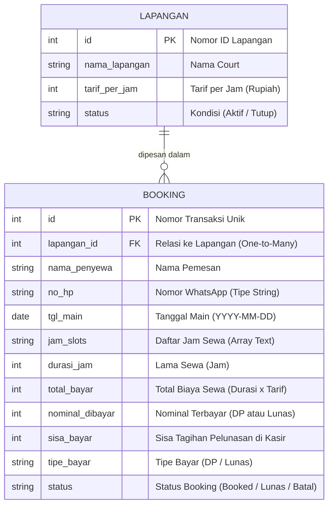

# Entity Relationship Diagram (ERD) - UKK RPL / PPLG
## Aplikasi Booking Lapangan Badminton & Kasir

Dokumen ini memenuhi **Kriteria Penilaian No. 4 Pra-UKK**:
> *"Entity Relationship Diagram dibuat"*

Diagram ini menggambarkan susunan **2 tabel utama** di basis data Supabase (PostgreSQL) yang berelasi *One-to-Many* secara presisi dan sinkron 100% dengan kode program di [src/types/database.ts](file:///home/rayhan/Windows-D/project/ukk-11/src/types/database.ts).

---

## 1. Diagram ERD Resmi (Relasi 1-to-Many)

```mermaid
erDiagram
    LAPANGAN ||--o{ BOOKING : "dipesan dalam"

    LAPANGAN {
        int id PK "Nomor ID Lapangan"
        string nama_lapangan "Nama Court"
        int tarif_per_jam "Tarif per Jam (Rupiah)"
        string status "Kondisi (Aktif / Tutup)"
    }

    BOOKING {
        int id PK "Nomor Transaksi Unik"
        int lapangan_id FK "Relasi ke Lapangan (One-to-Many)"
        string nama_penyewa "Nama Pemesan"
        string no_hp "Nomor WhatsApp (Tipe String)"
        date tgl_main "Tanggal Main (YYYY-MM-DD)"
        string jam_slots "Daftar Jam Sewa (Array Text)"
        int durasi_jam "Lama Sewa (Jam)"
        int total_bayar "Total Biaya Sewa (Durasi x Tarif)"
        int nominal_dibayar "Nominal Terbayar (DP atau Lunas)"
        int sisa_bayar "Sisa Tagihan Pelunasan di Kasir"
        string tipe_bayar "Tipe Bayar (DP / Lunas)"
        string status "Status Booking (Booked / Lunas / Batal)"
    }
```

---

## 2. Penjelasan Relasi Basis Data untuk Sidang UKK

### Hubungan `LAPANGAN` ke `BOOKING` (1-to-Many)
- **Artinya**: 1 Lapangan fisik dapat disewa berulang kali untuk banyak transaksi pemesanan pada jam atau tanggal yang berbeda.
- **Implementasi Kunci**: Pada tabel `BOOKING`, terdapat kolom `lapangan_id` (*Foreign Key*) yang terhubung langsung ke `id` (*Primary Key*) pada tabel `LAPANGAN`.

---

## 3. Bocoran Pertanyaan Penguji UKK Terkait ERD

### 1. "Mengapa menggunakan 2 tabel dan tidak dijadikan 1 tabel saja?"
> **Jawaban**: *"Untuk normalisasi data tingkat 3 (3NF) dan mencegah anomali redundansi data, Pak/Bu. Jika digabung menjadi 1 tabel, setiap kali ada orang menyewa Lapangan 1, sistem harus mengulang penulisan nama lapangan dan tarifnya berkali-kali. Dengan memisahkannya menjadi master LAPANGAN dan transaksi BOOKING, data lapangan cukup disimpan 1 kali dan dipanggil melalui foreign key `lapangan_id`."*

### 2. "Apa itu Primary Key dan Foreign Key di diagram kamu?"
> **Jawaban**:
> - **Primary Key (PK)**: `lapangan.id` dan `booking.id` sebagai identitas unik tiap baris data agar tidak pernah tertukar atau duplikat.
> - **Foreign Key (FK)**: `booking.lapangan_id` sebagai kunci relasi penghubung yang merujuk pada `lapangan.id`.

### 3. "Mengapa tidak ada tabel petugas/users?"
> **Jawaban**: *"Aplikasi berfokus pada arsitektur inti UKK (1 Master Data + 1 Transaksi Aktivitas). Operasional kasir dirancang terintegrasi langsung untuk efisiensi gelanggang tanpa birokrasi sesi login yang rumit, sehingga data transaksi langsung dikelola secara fungsional di dashboard kasir."*
