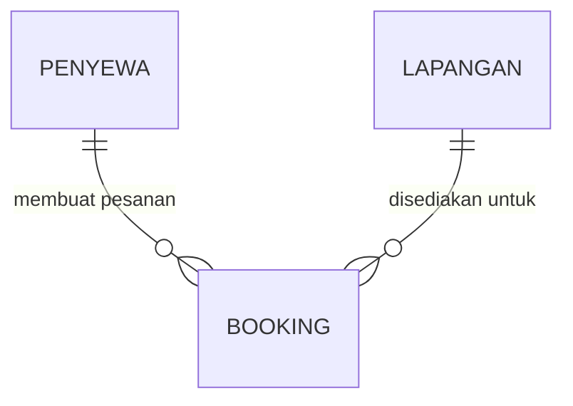

# Entity Relationship Diagram (ERD) - UKK RPL / PPLG
## Aplikasi Booking Lapangan Badminton & Kasir

Dokumen ini memenuhi **Kriteria Penilaian No. 4 Pra-UKK**:
> *"Entity Relationship Diagram dibuat"*

Diagram ini menggambarkan susunan **2 tabel utama** di basis data Supabase (PostgreSQL) yang berelasi *One-to-Many* secara presisi dan sinkron 100% dengan kode program di [src/types/database.ts](file:///home/rayhan/Windows-D/project/ukk-11/src/types/database.ts).

---

## 1. Diagram PDM / ERD Resmi (Relasi 1-to-Many)

```mermaid
erDiagram
    LAPANGAN ||--o{ BOOKING : "membuat pesanan"

    LAPANGAN {
        int id PK "Nomor ID Lapangan"
        string nama_lapangan "Nama Court"
        int tarif_per_jam "Tarif per Jam (Rupiah)"
        string status "Kondisi (Aktif / Tutup)"
    }

    BOOKING {
        int id PK "Nomor Transaksi Unik"
        int lapangan_id FK "Relasi ke Lapangan (Foreign Key)"
        string nama_penyewa "Nama Pemesan"
        string no_hp "Nomor WhatsApp (Tipe String)"
        date tgl_main "Tanggal Main (YYYY-MM-DD)"
        string jam_slots "Daftar Jam Sewa (Array Text)"
        int durasi_jam "Lama Sewa (Jam)"
        int total_bayar "Total Biaya Sewa (Durasi x Tarif)"
        int nominal_dibayar "Nominal Terbayar (DP atau Lunas)"
        int sisa_bayar "Sisa Tagihan Pelunasan di Kasir"
        string tipe_bayar "Tipe Bayar (DP / Lunas)"
        string status "Status Booking (Booked / Lunas / Batal)"
    }
```

---

## 2. Penjelasan Relasi Basis Data untuk Sidang UKK

### Kenapa Label Relasinya "Membuat Pesanan"?
- **Alur Bisnis**: Satu baris data `LAPANGAN` dapat dipilih berulang kali oleh pelanggan untuk **membuat pesanan** (`BOOKING`) pada tanggal atau jam yang berbeda.
- **Kardinalitas 1-to-Many (1:N)**:
  - 1 Lapangan dapat memiliki banyak pesanan booking (`1 : M`).
  - 1 Pesanan booking hanya merujuk pada 1 lapangan tertentu melalui kolom `lapangan_id` (*Foreign Key*).

---

## 3. Bocoran Pertanyaan Penguji UKK Terkait ERD

### 1. "Mengapa menggunakan 2 tabel dan tidak dijadikan 1 tabel saja?"
> **Jawaban**: *"Untuk normalisasi data tingkat 3 (3NF) dan mencegah anomali redundansi data, Pak/Bu. Jika digabung menjadi 1 tabel, setiap kali ada orang menyewa Lapangan 1, sistem harus mengulang penulisan nama lapangan dan tarifnya berkali-kali. Dengan memisahkannya menjadi master LAPANGAN dan transaksi BOOKING, data lapangan cukup disimpan 1 kali dan dipanggil melalui foreign key `lapangan_id`."*

### 2. "Apa itu Primary Key dan Foreign Key di diagram kamu?"
> **Jawaban**:
> - **Primary Key (PK)**: `lapangan.id` dan `booking.id` sebagai identitas unik tiap baris data agar tidak pernah tertukar atau duplikat.
> - **Foreign Key (FK)**: `booking.lapangan_id` sebagai kunci relasi penghubung yang merujuk pada `lapangan.id`.

### 3. "Mengapa tidak ada tabel petugas/users?"
> **Jawaban**: *"Aplikasi berfokus pada arsitektur inti UKK (1 Master Data + 1 Transaksi Aktivitas). Operasional kasir dirancang terintegrasi langsung untuk efisiensi gelanggang tanpa birokrasi sesi login yang rumit, sehingga data transaksi langsung dikelola secara fungsional di dashboard kasir."*

---

## 4. Perbedaan ERD (Konseptual) vs PDM (Fisik)

- **ERD (Entity Relationship Diagram)**:
  - Bersifat konseptual/logis.
  - Fokus pada nama entitas dan hubungan bisnis (misal: "Penyewa membuat Pesanan").
  - Belum memuat tipe data teknis (`int`, `varchar`) atau penanda `PK`/`FK`.
- **PDM (Physical Data Model)**:
  - Bersifat fisik/teknis langsung sesuai struktur database asli.
  - Menampilkan nama kolom presisi, tipe data database (`int`, `string`, `date`), serta penanda `PK` dan `FK`.
  - Diagram di atas adalah **PDM** karena sudah mencantumkan tipe data dan kolom riil Supabase.

---

## 5. Perbandingan Relasi: 2 Tabel (Riil) vs 3 Tabel (Teori Sekolah)

### Model 1: 2 Tabel (Proyek Kita - Efisien & Anti-Jebakan)
- Relasi: `LAPANGAN` -> (membuat pesanan) -> `BOOKING`
- Identitas pemesan langsung masuk ke kolom `nama_penyewa` & `no_hp`.

### Model 2: 3 Tabel (Jika Penguji Mewajibkan Entitas Penyewa Terpisah)

```mermaid
erDiagram
    PENYEWA ||--o{ BOOKING : "membuat pesanan"
    LAPANGAN ||--o{ BOOKING : "disediakan untuk"
```
- **Catatan Sidang**: Jika penguji bertanya *"Siapa yang membuat pesanan?"*, jawab: *"Pelanggan langsung membuat pesanan di kasir dengan mencatat nama dan no WhatsApp ke tabel booking tanpa perlu register akun."*
