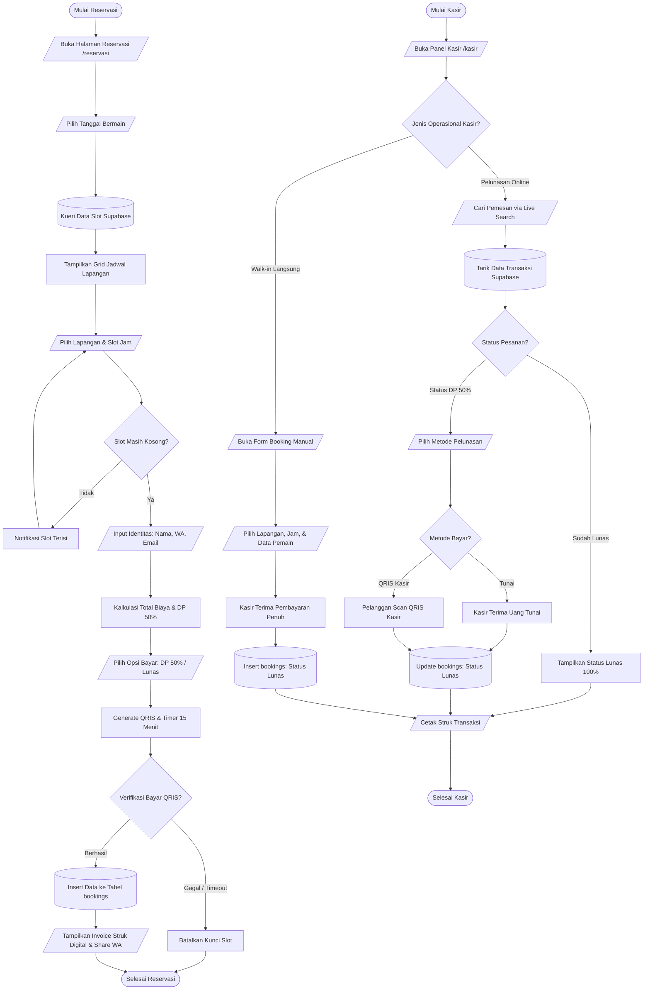

# Flowchart Sistem Reservasi & Kasir Lapangan Badminton (UKK RPL / PPLG)

Diagram alur kerja sistem dibuat bersih tanpa kotak pembungkus (*no subgraph containers*), berstandar ISO 5807 untuk kelancaran presentasi dan laporan UKK.

---

## 1. Tautan Langsung Mermaid Live Editor (Tanpa Kotakan)

- **[Buka Flowchart Gabungan (Pemesan + Kasir)](https://mermaid.live/edit#pako:eNp9VV1vGjkU_StXSFkRiexkSNJt87CrTEgoDCS0TBdtTR5uwAVrZjzI40lVofz3vf4aSLtaHhCyz7m-Pj7nsu-sqjXvXEPnW1F9X21RacgGSwn0OTmB-He4KRoFM17yGiU8ykJI7rZvumzaFCjgM6-5esFaPJ3C2dmfkLAoaXKEj1hgSaR2HyIVfkZPrkhiGbcsmolCbCFDudlgAQlXJQoZULcWNWDdtOFKwAA1wryoNMybHT5jzU89cGCBdyzDcieKnA4fKrGGMa6_U9UJ7qg-Sg--s-D7cHbYhd9c7TGW4fx7ixzu7fqU2t9CWtWV3Pz16gBDAkAm1phb5Ef2UGnxTeTm0paUUd8kkDvxiPMP2qURi0Zy12gYrbnUQmN9DQ8kXg8WNz24Iy2K0MvIEsYsxSIn-emArNJGMoE_kHofzODq_MSDxxachis-7gieEE5dexxEMGkk1qF6agkTNuSSK9QcPn0ezalqJkquIL6CKZdCe_DEgqf7v-ly_rK2uCUFaabmmkM0rxrZMhVd0_AeWELvaB8pbeTKCeUU-hp32ZwXZLk37joqSAbZ0lph4Y-sO5KE0s4ZOScfPfMCnqsqF3JTB3c8WvSMRQd7jORLJVYc5lo1OQzERhgtyQGUBE7iB11mvq-lbLPR99lIqQ9F0pJetagkFl7JOOTDAnw20r4Pxwwldei4kZFOtU_Qd8iL_Zi0ro8rO3xQ1sMvjB4zXphnbCPqSlyy6BYpMCG-LwJhIl7ouhzVatueeOngV6ybETx3MmYKZY25cfBPKUuvHP7dfq5RNzXVp-ooQ2PpO9PSvFnj1rnLwf84iqUnut34nAzrMDHpc8s15ci9SNtE26ur7ejew5b5Pph8yjWNtIMiLfO9A37Ye4T1atvzBxthogjfyfkNc89jslsifKHp4ABPxxQbEAf0vITR2XaQ0T1X9HWABCYV9-iYdb_s1iZpwa3Xb8Q5PVCSQAkrcdDsVz8sKFhnQtJQo4oNNW6Qi9ib775SJSTuPJpnssF2vCxc0UX_57HYMwOxZwaMMQc56mg-L5xlFxdvFSPQs9GYJJhx2WwD-sKhL9vY_v_VF5f_ec_YHfq1f5gVPmlL2elBp7T_IWvz37Y3lGVHbykHS1pYdtao8mVnKV8NEhtdzX_IFe2Q6TitNPZJBgI3Cku__PovKwIo1A)**
- **[Buka Flowchart Khusus Pemesan Online](https://mermaid.live/edit#pako:eNpNU11vm0AQ_CsrpFSOlAj7IS9-aBWC42D81YBatYcf1uaCTxx36DgSRZb_e5cD1PgJ7c3s7M6OL95J59ybg_cm9cfpjMZCGmYK6Pc4YZtWojjcwv39dwiYH7QlwgtKrFDBK2-4ecdGgG_GT__QUwPHeGL-XkhxhhRVUaCEgJsKhRpRTw4VskncciMgRIuQSG0haWs8YsNvB2DogAuWYlULWZL40ogcVph_UNc11tQf1QBeOPDzqD2-wre-9wqrUf_ZIZcXV9_Q-GeIdaNV8ePaA5YEgFTkWDrkC9tqK95E2S3tSCnN3YhDr_iF8wddKWJ-pOrWQpRzZYXFZg5bMu8Ofj_ewYK8kOMskSOsWIyyJNNJYGd1hVY0kGrbeSfwE2mJcA8P05uBtXKseNx1VxMvIJyZDzjwYd0qbGA2nd6MWrFjrdmSK27Qcvj5GiXUOhUVNzB7gA1Xwg7gtQNvLr9o1WF1p-BIo1Gbbukldjf2XRtNS3e8LQvoqu5kcatOvW29X39nE5ZwyZsuYV_aUEjOpCIdaMcmkaJw2T4dJacsHbmEo9alUEUzJmTn0Hvm_49IpN61OHFIrGlLCEUhOhspBRRyTgcY3dgP02TKuwOvchHNu3_EpXvPPHvmFc-okHk5mjLzMnXtkNhanXyqE72QAqdKW-fkZiiwMFgN5es_AFkGsg)**
- **[Buka Flowchart Khusus Kasir Operasional](https://mermaid.live/edit#pako:eNptk2Fv2jAQhv_KKVInkEAhQLu2HzaNokotoLImVaQ5fDjAI1YSJ7LjThXiv-8yx2HdygdA5-e9vHnvfPR25Z57t-D9zMtfuxRVDdE8kUCfRdBjK5OjgAVqoTZ9GA6_wGLM_JnJENYoeW6PwM-aH3_TCseWnBwfuRQaniqu6LyUmH89WaQFJwTCmudGokYJs7LMhDzAk8yF5LbJlPl3qARRBW-YV4GwFK8cQo5ql3bPnFr8kvUiwjOYY40QKZQaMy0gNBVuUfO-4y8tf3UMa6yNpv7UHaUzuLhqrIVmjyksG3sW_8wiLCqRZ-SkFdrTYDS62FgmoITueI0ZEcpkZxOdV9vbyudruBxdWOU189ciFymseE1jOSfTKa8teHP8l-h83zS9IyqK1s3oG7NDirgSBcK90BTPC8rD5m_J9-eHsJ1mq5sx6k7YoXnXHX2dEaek5i0dsN5Ltceaw9YOUd--C2gAodAIzxWM-mf1zKldJXAR_r8mbjlizLOhkODDksxpQ6VGEwftXt6XqujgFUqDuYsvtu3jsct5iRX1QDmARywG8MluDa0aii7z2G5zPHkfI0FbfEOaLf2VJnX0xNJT1nuQmtN1-jgPF0I8_fCNA_vQH-MeC3lOq9ldwkR6A_AKrsjjvrm4x0aSeHVKFyShQuLtUWWJl8hTQ6Kpy_BN7uiEtpFTxfyZ01zgQWHRlk-_AYz_Nog)**

---

## 2. Kode Diagram Bersih (Siap Tempel ke FigJam / Mermaid Live)

