# Flowchart Sistem Reservasi & Kasir Lapangan Badminton (UKK RPL / PPLG)

Diagram alur kerja sistem dibuat berstandar ISO 5807 dengan pembagian dua jalur: **Alur Pemesan (Customer Online)** dan **Alur Kasir (Staf Hall Utama)**.

---

## 1. Tautan Langsung Mermaid Live Editor
Buka tautan berikut di peramban untuk melihat visualisasi diagram atau mengunduh dalam format PNG / SVG / PDF:

**[Buka Flowchart di Mermaid Live Editor](https://mermaid.live/edit#pako:eNp9VV1v4kgQ_CstS3siEjljkuxHHu7ER8KCIXAxOXRr8tDgCYxsj5E9zmqF8t-vZ8YOY7S7PESRXTXdU13VPjrbLGLOLTgvSfZ9u8dcwnK4FkC_otzscjzsIfDCteP9Cb2kzGHBUlaggNagLGSWshzmIuGCXaydZ8NTv14rnJUJ8ucLuLz8C_qh2y9jhK-YYErkR1aw_BULDm5e_-ta9L5mDUJ3wRO-hyWK3Q4T6LM8RS5s5EAjh2HLL1nOYYgSIUgyCUF5wA0W7MICDzX4LlxieuBJTI2Mch7BBKPvdPoUD1QHhUW404T7uo8aAX-YGhNM7V7uNXp01O9mdKU9-FmRid3fbyfQiECw5BHGGv01fMgkf-GxEkMTl3SPgj-byme8_1A_HofuWBxKCeOICcklFrfwQMK2YdVrwx1plNh9jTVpEvqYxDQUKjSnyaHkBSwzqXTl-APpUsMF3HQ-WMyJZvr1_ecH4vYJm99WWHBhWgoswOt0Ptg1fc2chiMmWI6SwT-P44BKLLmyjHcDMya4tAhTTZgd_6XrV3LoSppoCzhTQoxQ-cHVx2UkhOI-hH2avh6rX4qtkdPo-M1rhQFLyLjkyLOjyFR7qpZo4DxsjQUZUhonxYy8t2EJbLIs5mJX2G6aa8YidE92GovXjG8ZBDIvYxjyHVfyklsoWIyGYyu0qDozT5iI1uI8d13KXbfKnU895tAKJL6oGCXwJGnizdT5XhU7g67C53er9C1Q0FXMQa5SOG9MrGvQV8cJjaagYdPgCp4JTGz5LcKVkm_BEmUAunzfaFTtA3PYdegOkHJZb41XjjDlr6QQw3y7b9S_NpSbsLUkSmwmsMxRFBircPwk0P6N4Xw8ki6yLKgOVUFhN-x_VG0GZYT7yqua8snaAhX55GTjGt8j5QZMUlTNQN-bafRtzjdHVKnQ7M91bGZM0pI9KdVgfzbgL8dzVOMOX_TWoBe86qzTC80g1bpIEe5pZ8TwROvp-Zymk2fAFbcfUhW9U-nuW_pzgjTc1OlVDC9sPR0iFeM6CLcN0doQ8ALh8QCdi-YJ_foE-6lXy_trW9VmWlGgL7lQe4YaLkp6pLgrr_L0fZan7-AZihIbq29lSq265yu8rZZ3W-085TKy59l3ZWXSsLpqykzAjdpKpNmCiXJvM64M4_p9hfxcK1ug1fVvlfBME9-679urDra1NJw2OKn-MEbqO35Ur9aO3FPi1vRg7USYx2tnLd4UEkuZBT_Elt6QpRk9KfVghxxp6aTV47f_AffYVak)**

---

## 2. Kode Diagram Mermaid (Salin ke FigJam / Mermaid Live)

```mermaid
flowchart TD
    subgraph S1["1. Alur Pemesan (Customer Online)"]
        A([Mulai]) --> B[/Buka Halaman Reservasi /reservasi/]
        B --> C[/Pilih Tanggal Bermain/]
        C --> D[(Kueri Data Slot Supabase)]
        D --> E[Tampilkan Grid Jadwal Lapangan]
        E --> F[/Pilih Lapangan & Slot Jam/]
        F --> G{Slot Masih Kosong?}
        G -- Tidak --> H[Notifikasi Slot Terisi] --> F
        G -- Ya --> I[/Input Identitas: Nama, WA, Email/]
        I --> J[Kalkulasi Otomatis Total Biaya & DP 50%]
        J --> K[/Pilih Opsi Bayar: DP 50% / Lunas 100%/]
        K --> L[Generate QRIS & Timer 15 Menit]
        L --> M{Verifikasi Bayar QRIS?}
        M -- Gagal / Timeout --> N[Batalkan Kunci Slot] --> Z1([Selesai])
        M -- Berhasil --> O[(Insert Data ke Tabel bookings)]
        O --> P[/Tampilkan Invoice Struk Digital & Share WA/]
        P --> Z1
    end

    subgraph S2["2. Alur Kasir (Staf Hall Utama)"]
        K1([Mulai Kasir]) --> K2[/Buka Panel Kasir /kasir/]
        K2 --> K3{Jenis Operasional?}
        
        K3 -- Pelunasan Booking Online --> K4[/Cari Pemesan via Live Search/]
        K4 --> K5[(Tarik Data Transaksi Supabase)]
        K5 --> K6{Status Pesanan?}
        K6 -- Sudah Lunas --> K7[Tampilkan Status Lunas 100%] --> K12[/Cetak Struk Transaksi/]
        K6 -- Status DP 50% --> K8[/Pilih Metode Pelunasan/]
        K8 --> K9{Metode Pelunasan?}
        K9 -- Tunai --> K10A[Kasir Terima Fisik Uang]
        K9 -- QRIS Kasir --> K10B[Pelanggan Scan QRIS Kasir]
        K10A --> K11[(Update bookings: Status Lunas, Sisa Rp 0)]
        K10B --> K11
        K11 --> K12
        
        K3 -- Booking Walk-in / Langsung --> W1[/Buka Form Booking Manual/]
        W1 --> W2[/Pilih Lapangan, Jam, & Data Pemain/]
        W2 --> W3[Kasir Terima Pembayaran Penuh]
        W3 --> W4[(Insert bookings: Status Lunas)]
        W4 --> K12
        
        K12 --> Z2([Selesai Kasir])
    end
```

---

## 3. Penjelasan Notasi Simbol (Standar ISO 5807)
- **Terminator `([ ... ])`**: Titik awal (`Mulai`) dan akhir (`Selesai`) dari alur proses.
- **Input / Output `[/ ... /]`**: Interaksi data dari formulir pengguna (tanggal, data pemesan, struk).
- **Proses `[ ... ]`**: Komputasi aritmatika (hitung DP 50%, timer QRIS, terima uang).
- **Keputusan `{ ... }`**: Logika percabangan kondisi (*Ya / Tidak*, jenis metode pembayaran).
- **Basis Data `[( ... )]`**: Operasi pembacaan atau penulisan data ke PostgreSQL Supabase.
