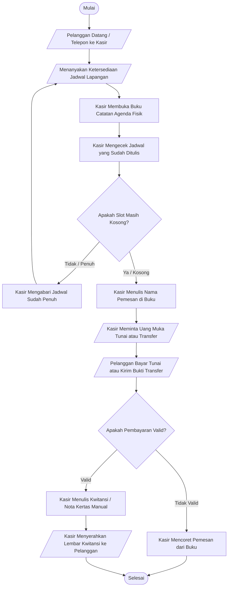
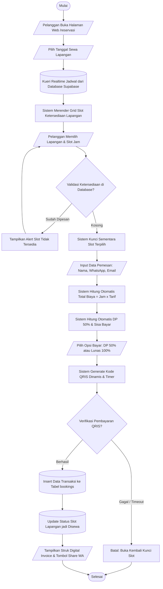

# Dokumentasi Flowchart Manual & Flowchart Sistem (UKK RPL / PPLG)

Dokumen ini memenuhi **Kriteria Penilaian No. 1 Pra-UKK**:
> *"Flowchart manual dibuat sesuai analisa"*

Untuk memperoleh nilai maksimal dari penguji, dokumentasi menyajikan perbandingan antara **Sistem Manual (Sistem Berjalan Konvensional)** dengan **Sistem Terkomputerisasi (Aplikasi Web Usulan)**.

---

## 1. Flowchart Sistem Manual (Sistem Berjalan Sebelum Komputerisasi)

### Tautan Langsung Mermaid Live (Tanpa Kotakan)
**[Buka Flowchart Manual di Mermaid Live Editor](https://mermaid.live/edit#pako:eNptU8tunEAQ_JUWJ0eKhdmHHzkksrPKIRjL0pJIEfjQC20YAcNqmNEKrfbf08M7D07Q01XVVdOcnaROyfkEzntZn5IclYZwF0vgJ_CuosCUKN4-wPX1ZwhWkftKJcosQwk71PwGLoRU0rGWUBD42Ajlvg3wVY9aR25AEmWLBcN80qQaSgXyx3dMT1jCMx6ZCuWEXPfITdQRQkDVwRQIT6Yw8JV1WRkeM5IpwjfRiGLEbXrcdsLJjBIqRp3WDrw3KeawE9qUohmB2x54e3488pQ57MtaQ8AkOfh1U8vsy2XovOVOCEWKBVt_JWnyHnq30MQDKjGK9npd56h2NwSzpPyFzNdr9af3M6GdFF6wQqapqGHzqejCGAnve8hD5E6BCakRfljDgY0uNBIFcHAGQoWyeaf5nh56tHezvN4nbFEtYb5QorKqWvxL4d0MHN6YIE96sBRM9RNLkU4Bet6cYHcyIFez36RWpGevNszO7dC5vYr2vHONXcw_SJd067_i80-Ct6YRnPJLzdH4pDQ2fMfSYDnZGBbP28xJypYU5nZ1n60lNTPxwk95zUls_jul8xGcilSFIrU_29l2x47O2WPMhdhhl0XsxPJiO9Hoet_KhE-0MsQVc0xR005gprAaypffm80rPQ)**

### Kode Diagram Mermaid

### Kelemahan Sistem Manual untuk Jawaban Sidang:
- Risiko tinggi bentrok jadwal (*double booking*) karena kesalahan manusia mencatat di buku.
- Buku catatan kertas rentan hilang, sobek, atau terkena tumpahan air.
- Pelanggan harus menunggu konfirmasi telepon/chat kasir secara lambat.
- Rekapitulasi keuangan harian harus dihitung satu per satu menggunakan kalkulator.

---

## 2. Flowchart Sistem Terkomputerisasi (Aplikasi Web Usulan)

### Tautan Langsung Mermaid Live (Tanpa Kotakan)
**[Buka Flowchart Sistem di Mermaid Live Editor](https://mermaid.live/edit#pako:eNp1VF1P20AQ_CsrS6AggRIHQkiktiJKBSFQKHbhweFhEy_J1eezdXeGooj_3j1_BaQ2T_F5Z3Z2Z85bb5XF5I3Be5bZ62qD2kI4XSjgX-B3optCong6gKOjrxD0o-4dSVTrNSqYFAnCJUpM-eGRltDVZEi_oBHdp5qgX-GOGSek2EBYYiUE9IpwjTk_omqrj6vqk6gzL0gLuCeUVqQEVxi_MipGPpyixSUagqDIyz8HDfykgg-iQBhLKdyQJhWThgstYghkZmFOlrShWCBrbvo3-EGFP_045A2lpfCmFvYroitMW9mnFW64fUApYh7_c5t4p_nbew0ZMoQHiHEDU5GT4bKS4ywKMc2FTPjgXBJ7UXYLmTaBsOZ8qnV-5JpnJlPr6sWoWcC8UCvBu05JWdRYc5HO3UiN-lEF8ntRd6bywpZi4Y5BrGoMP9jeQ3jcoDXneX4I31MUsh3d79Vov-l5KWzBQm5tlqIVBsLMsnMTgW8IX9za4A-nQIvnlsKvKfr_o5jewaC35zYvDMKEmXQLrgPmtwm7zXn_Zc24AfI8BVwXCg34vd7eTnydN_-k6XxBijRa4nXGBD_vZwHbozBlEftsQkq7xnXY_MH2gaP6LBLnO29t6Vqzew7c2u27aMEFuuh3S6KMF10RnEYTFijH1X2aOwYpGuvYsNrtfq8TBSTZFL6Nn2gnpDfcXNZ8w6gzU8ZFpzQyZDEGExaXEC9-SRKWWZYItTbtxfGHNfYs6vzKY7eAwKItTJWYNvu_0WVZGL68O-xZjR1F3V12A6uLhEvXwrk_Uy-ZWJHbYZYuM77-_JkheDzfWTH655TeIXi8dI5c7L5QW1e98OyGw7ngg4XHX4Rk4S3Uu6vEwmbBm1rxG25PfFKUw0wFrjWm9fH7X8T0idE)**

### Kode Diagram Mermaid

### Keunggulan Sistem Komputerisasi untuk Jawaban Sidang:
- **Pilar Validasi Database**: Mencegah bentrok jadwal 100% dengan pengecekan realtime di Supabase PostgreSQL.
- **Pilar Kalkulasi Otomatis**: Menghitung tarif per jam, durasi, dan komitmen DP 50% tanpa campur tangan kalkulator manual.
- **Pilar Mutasi Status**: Slot waktu otomatis berubah menjadi `Booked` seketika saat pembayaran QRIS diverifikasi.
- **Transparansi & Bukti**: Struk invoice tersimpan di `localStorage` dan dapat dibagikan otomatis ke WhatsApp pelanggan.
