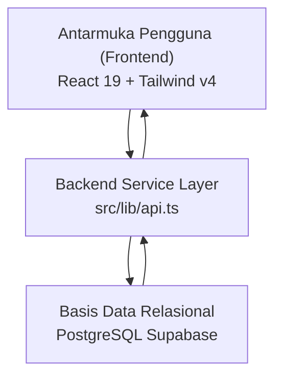

# Panduan Lengkap Belajar Codebase UKK RPL

Dokumen ini disusun khusus sebagai bahan belajar komprehensif bagi siswa SMK untuk memahami seluruh alur kode program, arsitektur sistem, struktur database, serta cara menjawab pertanyaan penguji pada Uji Kompetensi Keahlian (UKK) Rekayasa Perangkat Lunak.

---

## 1. Ringkasan Sistem & Arsitektur Proyek

### A. Tujuan Aplikasi
Aplikasi ini adalah sistem reservasi dan operasional kasir gelanggang olahraga (badminton / futsal) berbasis web. Sistem memiliki dua antarmuka utama:
1. **Halaman Publik / Penyewa (`reservasi.html`)**: Memilih tanggal, lapangan, slot jam bebas bentrok, serta pembayaran DP 50% atau Lunas.
2. **Halaman Kasir & Admin (`kasir.html`)**: Memantau jadwal lapangan secara visual, memvalidasi transaksi masuk, melakukan pelunasan sisa bayar DP, dan mengelola master data lapangan (CRUD).

### B. Tech Stack Resmi
- **Frontend**: React 19, TypeScript, Vite.
- **Styling**: Tailwind CSS v4 (modern utility-first engine).
- **Backend & Database**: Backend-as-a-Service (BaaS) menggunakan PostgreSQL di Supabase. Koneksi dihubungkan via `@supabase/supabase-js`.

### C. Diagram Arsitektur 3 Lapis (3-Tier Architecture)



---

## 2. Struktur Direktori Proyek

Berikut adalah peta folder utama yang wajib dipahami letak dan fungsinya:

```
ukk-11/
├── index.html               # Halaman landing page promosi
├── reservasi.html           # Halaman pemesanan penyewa
├── kasir.html               # Halaman dashboard operasional kasir
├── src/
│   ├── types/
│   │   └── database.ts      # Model skema data tabel Supabase
│   ├── lib/
│   │   ├── supabase.ts      # Inisialisasi client & koneksi DB
│   │   └── api.ts           # Controller backend (CRUD & Query)
│   ├── utils/
│   │   ├── costCalculation.ts # Rumus hitung DP 50% & total biaya
│   │   └── formatters.ts      # Format mata uang Rupiah & tanggal
│   ├── components/
│   │   ├── reservation/     # Komponen UI kalender pemesanan
│   │   ├── cashier/         # Komponen UI dashboard kasir
│   │   └── blanca/          # Komponen UI landing page
│   └── hooks/               # Custom hooks pemanggilan data
```

---

## 3. Skema Basis Data & Model Data

Model data didefinisikan secara ketat pada berkas [src/types/database.ts](file:///home/rayhan/Windows-D/project/ukk-11/src/types/database.ts).

### A. Tabel `lapangan` (Master Data)
Menyimpan data fisik gelanggang/lapangan yang disewakan.

- `id` (`number`): Primary Key, auto-increment integer.
- `nama_lapangan` (`string`): Nama lapangan (contoh: "Court 1 - Vinyl").
- `tarif_per_jam` (`number`): Biaya sewa per jam (contoh: 50000).
- `status` (`'Aktif' | 'Tutup'`): Ketersediaan operasional lapangan.

### B. Tabel `bookings` (Data Transaksi)
Menyimpan data transaksi reservasi oleh penyewa atau kasir.

- `id` (`number`): Primary Key transaksi.
- `lapangan_id` (`number`): Foreign Key yang terhubung ke `lapangan.id` (Relasi One-to-Many).
- `nama_penyewa` (`string`): Nama lengkap pelanggan.
- `no_hp` (`string`): Nomor telepon/WhatsApp. **Poin Sidang**: Mengapa bertipe string? Karena jika menggunakan tipe integer, angka `0` di awal nomor (misal `0812...`) akan terpotong oleh sistem.
- `tgl_main` (`string`): Tanggal sewa dengan format ISO `YYYY-MM-DD`.
- `jam_slots` (`string[]`): Kumpulan jam yang dipilih dalam bentuk text array (contoh: `['08:00', '09:00']`). Mengizinkan satu transaksi memesan banyak jam sekaligus tanpa menduplikasi baris database.
- `durasi_jam` (`number`): Jumlah jam yang dipesan (`jam_slots.length`).
- `total_bayar` (`number`): Total biaya sewa (`durasi_jam * tarif_per_jam`).
- `nominal_dibayar` (`number`): Uang yang sudah disetor (bisa 50% jika DP atau 100% jika Lunas).
- `sisa_bayar` (`number`): Kekurangan pembayaran yang harus dilunasi di kasir.
- `tipe_bayar` (`'Lunas' | 'DP'`): Metode pembayaran yang dipilih pelanggan.
- `status` (`'Booked' | 'Lunas' | 'Batal'`): Status operasional reservasi.

---

## 4. Bedah Backend Controller: `src/lib/api.ts`

Berkas [src/lib/api.ts](file:///home/rayhan/Windows-D/project/ukk-11/src/lib/api.ts) adalah pusat seluruh interaksi data antara aplikasi dan basis data. Berkas ini dibagi menjadi 3 bagian inti:

### Bagian 1: CRUD Master Lapangan
1. **`getLapangan()`**:
   - Menjalankan `SELECT * FROM lapangan ORDER BY id ASC`.
   - Digunakan oleh kalender dan menu manajemen lapangan kasir.
2. **`createLapangan(data)`**:
   - Menjalankan perintah `INSERT INTO lapangan`.
3. **`updateLapangan(id, data)`**:
   - Menjalankan perintah `UPDATE lapangan WHERE id = id`.
4. **`deleteLapangan(id)`**:
   - Menjalankan perintah `DELETE FROM lapangan WHERE id = id`.

### Bagian 2: Transaksi Booking & Cek Bentrok Jadwal
1. **`getBookedSlots(lapanganId, tglMain)`**:
   - **Logika**: Mengambil semua `jam_slots` dari tabel `bookings` untuk lapangan dan tanggal yang diminta, dengan syarat `status != 'Batal'`.
   - Menggabungkan hasilnya menjadi satu array jam yang sudah terisi. Jam-jam ini kemudian otomatis dikunci (disabled) di antarmuka pengguna agar tidak bisa dipilih oleh orang lain.
2. **`createBooking(data)`**:
   - Menjalankan perintah `INSERT INTO bookings` untuk mencatat transaksi sewa baru.

### Bagian 3: Operasional Kasir & Pelunasan
1. **`getAllBookings()`**:
   - Menjalankan `SELECT *, lapangan(*) FROM bookings ORDER BY created_at DESC`.
   - Mengambil data booking sekaligus melakukan relasi JOIN dengan tabel `lapangan` secara otomatis tanpa query tambahan.
2. **`updateStatusBooking(id, status, sisaBayar)`**:
   - Menjalankan `UPDATE bookings SET status = status, sisa_bayar = sisaBayar WHERE id = id`.
   - Digunakan kasir saat tombol **Lunasi** ditekan: status diubah menjadi `'Lunas'` dan `sisa_bayar` disetel ke `0`.
3. **`searchBookings(keyword, status)`**:
   - Memfilter transaksi di sisi database menggunakan operator SQL `ilike` untuk pencarian nama penyewa dan `eq` untuk filter status.

---

## 5. Logika Bisnis & Perhitungan Biaya

Logika perhitungan matematika diisolasi di [src/utils/costCalculation.ts](file:///home/rayhan/Windows-D/project/ukk-11/src/utils/costCalculation.ts):

```typescript
export function calculateBookingCost(durationHours: number, ratePerHour: number) {
  const totalCost = durationHours * ratePerHour
  const downPayment = totalCost * 0.5
  const remainingCost = totalCost - downPayment

  return {
    totalBayar: totalCost,
    nominalDP: downPayment,
    sisaBayar: remainingCost
  }
}
```

### Aturan Pembayaran:
- **Pilihan Lunas**:
  - `nominal_dibayar` = `total_bayar`
  - `sisa_bayar` = `0`
  - `status` = `'Lunas'`
- **Pilihan DP 50%**:
  - `nominal_dibayar` = `total_bayar * 0.5`
  - `sisa_bayar` = `total_bayar - nominal_dibayar`
  - `status` = `'Booked'` (menandakan jadwal sudah dipegang namun pembayaran belum tuntas)

---

## 6. Alur Pengguna (User Flow)

### A. Alur Pemesanan oleh Penyewa
1. Pengguna membuka [reservasi.html](file:///home/rayhan/Windows-D/project/ukk-11/reservasi.html).
2. Memilih tanggal sewa pada kalender.
3. Sistem memanggil `getBookedSlots()` untuk mencari jam yang sudah terisi di database.
4. Jam yang bentrok otomatis berwarna abu-abu / terkunci. Pengguna memilih jam yang masih kosong.
5. Pengguna mengisi form nama lengkap dan nomor WhatsApp.
6. Pengguna memilih skema pembayaran (DP 50% atau Lunas).
7. Tombol konfirmasi ditekan -> sistem menjalankan `createBooking()` ke database Supabase.

### B. Alur Operasional Kasir
1. Petugas kasir membuka [kasir.html](file:///home/rayhan/Windows-D/project/ukk-11/kasir.html).
2. Memantau jadwal lapangan di tab grid visual atau tabel transaksi.
3. Ketika penyewa datang ke lokasi gelanggang untuk melunasi sisa biaya sewa:
   - Kasir mencari nama penyewa lewat input pencarian.
   - Kasir menekan tombol **Lunasi**.
   - Sistem memanggil `updateStatusBooking(id, 'Lunas', 0)`.
   - Data otomatis terbarui dan status transaksi berganti menjadi Lunas.

---

## 7. Bocoran 10 Pertanyaan Penguji UKK & Cara Jawab Taktis

Berikut adalah daftar pertanyaan yang paling sering diajukan oleh tim penguji UKK beserta panduan jawaban singkat dan tepat:

### Q1: "Mana server backend kamu? Mengapa tidak menggunakan Express.js atau Laravel?"
- **Jawaban**: *"Aplikasi ini menerapkan arsitektur modern Backend-as-a-Service (BaaS) berbasis PostgreSQL Supabase. Logika API Controller dan query dipusatkan secara modular di berkas `src/lib/api.ts`. Pendekatan ini mempercepat performa aplikasi, mengeliminasi boilerplate server, dan menjaga keamanan lewat Row Level Security (RLS) bawaan database."*

### Q2: "Bagaimana cara sistem kamu mencegah dua orang booking lapangan dan jam yang sama (bentrok jadwal)?"
- **Jawaban**: *"Pencegahan bentrok ditangani oleh fungsi `getBookedSlots()` di `src/lib/api.ts`. Setiap kali tanggal dipilih, sistem memeriksa tabel `bookings` untuk lapangan terkait dengan status yang tidak batal. Seluruh jam yang sudah terdaftar langsung dikembalikan ke frontend dan dinonaktifkan atribut `disabled`-nya pada tombol slot jam."*

### Q3: "Apa tipe relasi basis data yang kamu gunakan?"
- **Jawaban**: *"Relasi One-to-Many antara tabel `lapangan` (satu) dan tabel `bookings` (banyak). Kolom `bookings.lapangan_id` berperan sebagai Foreign Key yang merujuk pada `lapangan.id`. Satu lapangan dapat memiliki banyak transaksi reservasi."*

### Q4: "Mengapa kolom nomor HP di database kamu bertipe string / varchar, bukan integer?"
- **Jawaban**: *"Karena nomor telepon di Indonesia selalu diawali dengan angka 0 (contoh: 0812...). Jika menggunakan tipe data Integer, angka 0 paling depan akan dianggap tidak bernilai dan otomatis terpotong menjadi 812..."*

### Q5: "Bagaimana cara menyimpan durasi booking yang lebih dari 1 jam?"
- **Jawaban**: *"Kami memanfaatkan tipe data Text Array (`string[]`) pada kolom `jam_slots` di PostgreSQL. Sebagai contoh, jika penyewa memesan 2 jam, data yang disimpan adalah `['09:00', '10:00']`. Ini membuat satu nomor invoice transaksi dapat menampung multi-slot tanpa perlu membuat baris data duplikat di database."*

### Q6: "Bagaimana rumus perhitungan DP dan pelunasan di aplikasi ini?"
- **Jawaban**: *"Rumus diisolasi di `src/utils/costCalculation.ts`. Total biaya dihitung dari `durasi_jam * tarif_per_jam`. Jika penyewa memilih DP 50%, nominal bayar dihitung `total_biaya * 0.5` dan sisanya disimpan di kolom `sisa_bayar`. Ketika pelunasan dilakukan di kasir, `updateStatusBooking` mengubah `sisa_bayar` menjadi 0 dan status menjadi 'Lunas'."*

### Q7: "Bagaimana cara kerja query pencarian kasir agar tidak lambat?"
- **Jawaban**: *"Pencarian dijalankan langsung di level database pada fungsi `searchBookings` menggunakan operator SQL `ilike` untuk pencarian teks case-insensitive (nama penyewa) dan `eq` untuk filter status. Ini menghindari pemborosan memori browser."*

### Q8: "Di mana kredensial database disimpan dan apakah aman?"
- **Jawaban**: *"Kredensial URL dan Anon Key disimpan di berkas `.env` (`VITE_SUPABASE_URL` dan `VITE_SUPABASE_ANON_KEY`). Berkas `.env` telah dimasukkan ke dalam `.gitignore` sehingga kunci rahasia tidak pernah terunggah ke repositori Git publik."*

### Q9: "Apa keunggulan React 19 dan Tailwind CSS v4 di proyek ini?"
- **Jawaban**: *"React 19 memberikan render komponen yang sangat cepat dan reaktif, sementara Tailwind CSS v4 menggunakan engine kompilasi berbasis CSS modern tanpa konfigurasi file JS tambahan yang rumit, sehingga ukuran bundle frontend tetap ringan."*

### Q10: "Jika ada transaksi yang dibatalkan, apakah slot jamnya bisa dipesan orang lain?"
- **Jawaban**: *"Bisa. Pada fungsi `getBookedSlots`, query menyertakan filter `.neq('status', 'Batal')`. Artinya, transaksi berstatus 'Batal' diabaikan oleh sistem, sehingga jam yang sebelumnya terisi otomatis kembali berstatus tersedia untuk disewa pemesan lain."*
